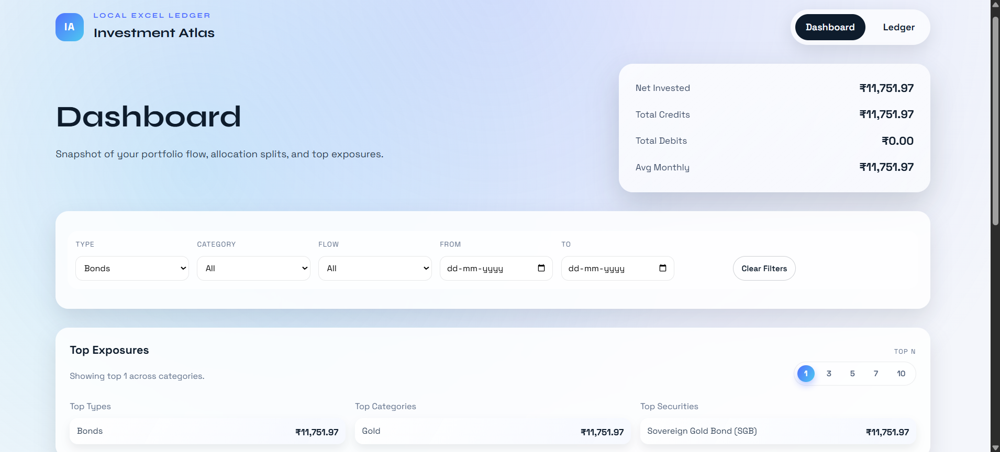
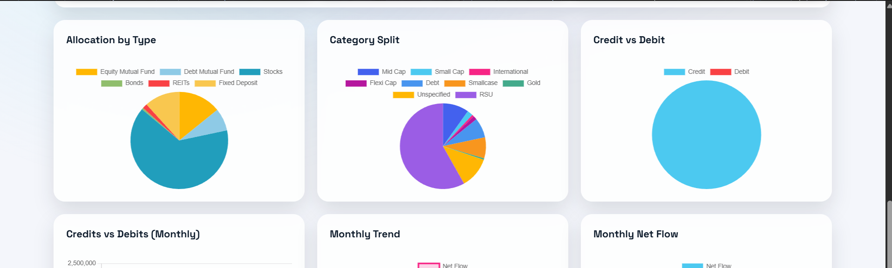
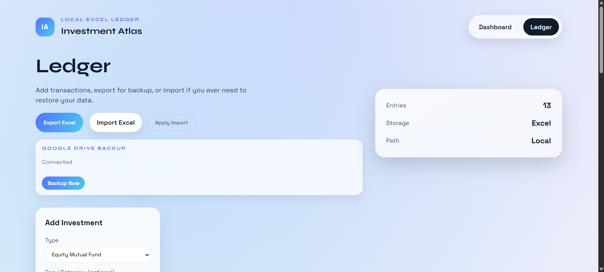
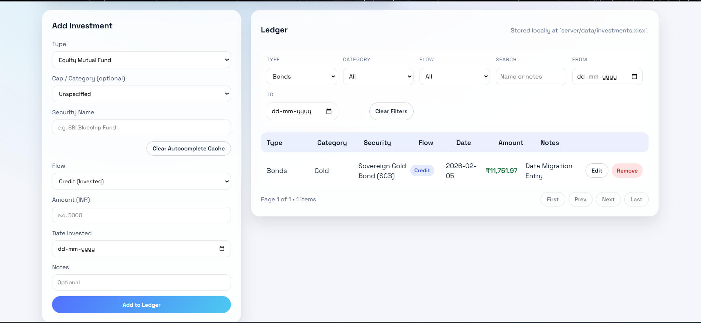
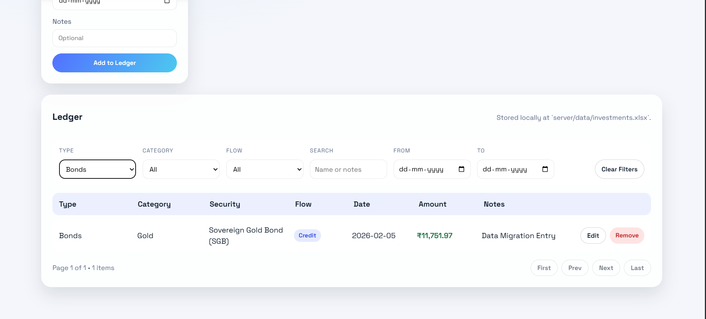

# Investment Atlas

A local-first investment tracker with Excel storage, a Node.js API, and a React dashboard with charts.

## Screenshots







## Features

- Local Excel ledger stored on your machine
- Add investments with type, category, security name, credit/debit flow, and notes
- Dashboard with allocation, category split, monthly flow, and trend charts
- Searchable security name autocomplete (with caching)
- Edit entries in a side drawer
- One-click Google Drive backup
- Import/export Excel

## Quick Start (One Click)

1. Double-click `start-app.bat` in the project root.
2. Your browser opens at `http://127.0.0.1:5173`.

The app creates/uses the Excel ledger at `server/data/investments.xlsx`.

## Manual Start (Dev)

1. Start the server:

```bash
cd server
npm install
npm run dev
```

2. Start the client:

```bash
cd client
npm install
npm run dev
```

UI: `http://127.0.0.1:5173`
API: `http://127.0.0.1:4000`

## Autocomplete (Security Name)

We use Alpha Vantage `SYMBOL_SEARCH` and fall back to MFAPI for Indian mutual funds.

1. Copy `server/.env.example` to `server/.env`
2. Add your key:

```
ALPHA_VANTAGE_KEY=your_key_here
```

If no key is configured, autocomplete is disabled but everything else works.
Results are cached for a few hours to reduce API calls. There is also a
"Clear Autocomplete Cache" button in the Ledger.

## Google Drive Backup

Click "Connect Drive" once to authorize, then "Backup Now" to upload/update the
Excel file in Google Drive inside a folder named `Investment Atlas`.

1. Create OAuth credentials in Google Cloud (Desktop or Web App).
2. Add to `server/.env`:

```
GOOGLE_CLIENT_ID=your_google_client_id_here
GOOGLE_CLIENT_SECRET=your_google_client_secret_here
GOOGLE_REDIRECT_URI=http://localhost:4000/api/drive/oauth2callback
```

Tokens are stored locally at `server/.drive_token.json` (ignored by git).

## Data File Locations

- `server/data/investments.xlsx`

## Notes

- Excel import replaces the current ledger.
- Amounts are displayed in INR.
- Debit entries reduce totals and charts.

## Developer Docs

See `DOCS.md` for architecture and maintenance details.
